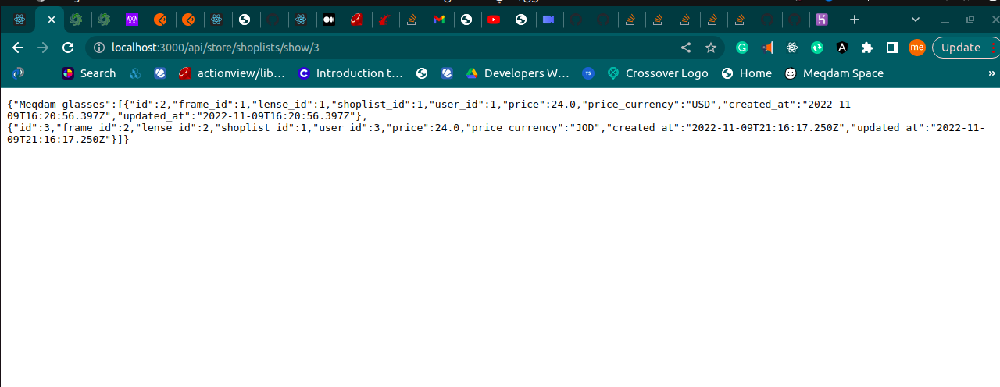

# MessageMeApp

## Built With
- ruby on rails
## Video demo
-[Video demo](https://www.loom.com/share/f54a646d8a994914a7e3bd44fec3f6de)
## Deployed version

  [link]()

### Prerequisites

Chrome or any explorer
### USAGE
You can try to use this app using postman 
or you just use it in your application

| admin | user |
| ----- | ---- |
|get all frames: GET/(/api/admin/frames) |  get active frames: GET(/api/store/frames) |
|get all lenses: GET (/api/admin/lenses) |get all lenses: GET (/api/store/lenses)  |
Create Frame POST (/api/admin/frames) | Can't |
Edit a frame PATCH (/api/admin/frames/:id) | Can't |
Delete frame DELETE (/api/admin/frames/:id) | Can't |
Create Lense POST (/api/admin/lenses) | Can't |
Edit a lense PATCH (/api/admin/lenses/:id) | Can't |
Delete lense DELETE (/api/admin/lenses/:id) | Can't | 
Create A glass:

 `Post (/api/store/shoplists/create_glasse)`
 `Parameters: (frame_id,ueser_id,lense_id)` |
 | ----------------------------------------- |

 Show Glass
 `GET (/api/store/shoplists/show/:user_id)` |
 | ----------------------------------------- |

 Create User

 `POST (api/store/users)`

 `Parameters (name , user_currency)` |
 | ----------------------------------------- |

 See all users 

 `GET (api/store/users)`|
 | ----------------------------------------|
## Get started 
  if you just want to test the app you can use Johndo as a username and (12345654321) as a password
## Authors

👤 **Meqdam Al-qudah**

- [GitHub](https://github.com/MeqdamAlqudah)
- [Twitter](https://twitter.com/MeqdamQudah)
- [LinkedIn](www.linkedin.com/in/meqdam-al-qudah-7514a21b5)
